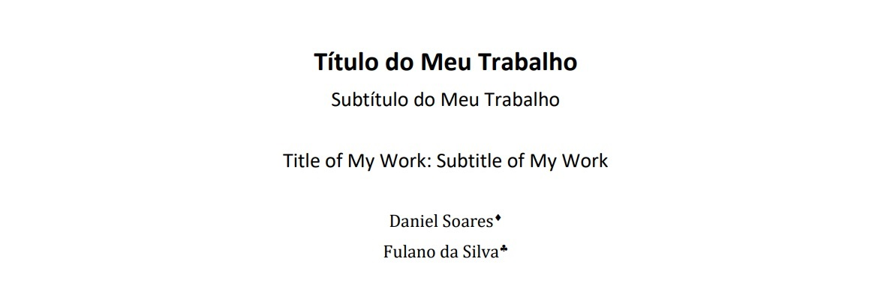
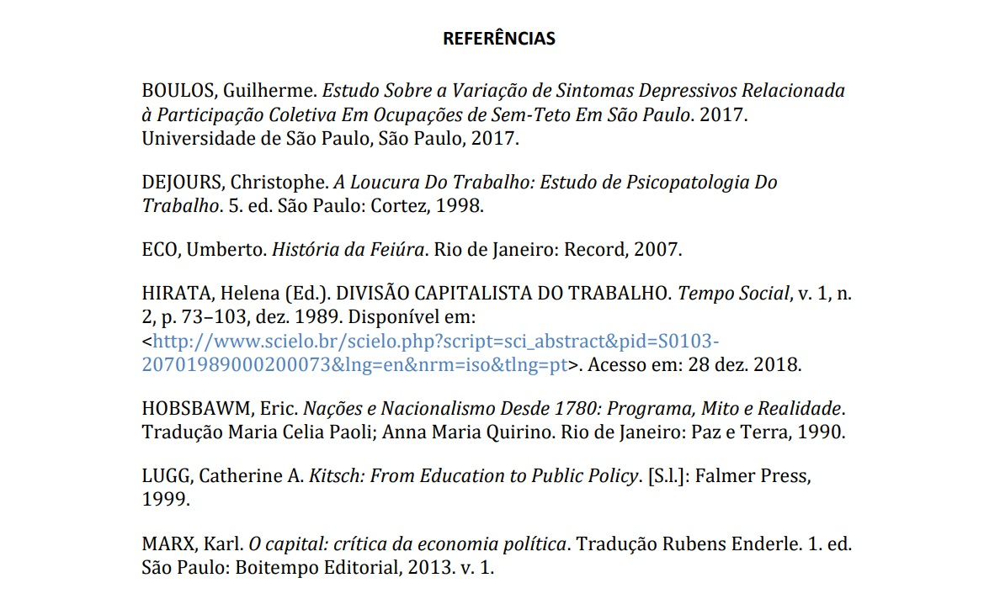

Antes de mais nada, é preciso deixar claro alguns pontos:

1. As normas da ABNT abrangem um sem número de áreas, não estão restritas à escrita acadêmica. Sabe o padrão recente de tomadas elétricas? Pois é, agradeça à ABNT e à norma NBR 14136;
2. As normas que dizem respeito à elaboração de textos acadêmicos estão distribuídas em alguns documentos. Aqui iremos usar, além da já citada NBR 6022, algumas outras, como a NBR 6023 (regras para elaboração de referências), a NBR 6024 (regras para a numeração progressiva das sessões do documento), a NBR 6028 (elaboração de resumos) e a NBR 10520 (regras para citações);
3. As normas para a elaboração de artigos são distintas das normas para trabalhos acadêmicos (NBR 14724) como Monografias, Trabalhos de Conclusão, Dissertações e Teses;
4. As normas oficiais não estão disponíveis para consulta, elas são pagas (e caras), mas nada que uma rápida pesquisa no seu buscador _web_ favorito com o nome da norma que precisa não resolva.

> O ~~Google~~ [Duck Duck Go](https://duckduckgo.com/) é seu pastor, nada lhe faltará (autor desconhecido).

Esclarecidos esses pontos, vamos ao que interessa. [Aqui tem um modelo](/artigo_ABNT_NBR-6022.zip 'Modelo de artigo com a NBR 6022 de 2018') de artigo com todos os elementos, obrigatórios e opcionais, de acordo com a ABNT.

## Elementos obrigatórios e opcionais de um artigo científico

Elementos pré-textuais:

- Título no idioma do documento **(obrigatório)**
- Título em outro idioma **(opcional)**
- Autor com currículo e vinculação **(obrigatório)**
- Resumo no idioma do documento **(obrigatório)**
- Resumo em outro idioma **(opcional)**
- Datas de submissão e aprovação do artigo **(obrigatório)**
- Identificação e disponibilidade **(opcional)**

O **título** do seu artigo deve ser o primeiro elemento do seu documento. Caso haja um **subtítulo**, esse deve ser diferenciado tipograficamente do título. A norma não define como seria essa diferenciação mas, normalmente, o título fica em negrito na primeira linha e o subtítulo numa linha abaixo com corpo normal.

Outra forma de apresentar o título e o subtítulo, de acordo com a norma, é separando-os por dois-pontos. Exemplo: **Título do Artigo: Subtítulo**.

O título em outro idioma (elemento opcional) vem logo abaixo do título no idioma do documento.

A ABNT não define os espaçamentos, alinhamento (se justificado, centralizado ou alinhado à esquerda) fonte, tamanho e peso (se normal ou negrito) do título. Fica a seu critério.

O elemento seguinte é o **autor** do documento: ele deve ser grafado de forma direta com prenome (abreviado ou não) e sobrenome. Caso haja mais de um autor, os nomes podem ser escritos na mesma linha, separados por vírgula, ou apresentando um autor por linha. Aqui, também, não tem a especificação tipográfica, fica a seu critério definir o peso e alinhamento.

Cada autor deve ter um currículo sucinto - normalmente a titulação, a vinculação e um endereço para contato. A norma recomenda que essas informações venham em notas de rodapé com um sistema de chamada distinto do restante do texto. Entretanto, não é a coisa mais corriqueira e intuitiva do mundo mudar o sistema de chamada das notas de rodapé no _Microsoft Word_. Caso tenha dúvidas nessa parte, apenas ignore e use a numeração progressiva, pois isso se trata apenas de uma recomendação e não de uma regra.

Outro ponto que a norma não aborda é a ordem da apresentação dos autores. Em documentos com mais de um autor, o costume é apresentá-los em ordem alfabética, seja pelo prenome, seja pelo sobrenome. Isso também é uma escolha sua.

O próximo elemento é o **resumo**. Esse deve ser elaborado de acordo com a norma NBR 6028 que, de forma (bem) sintética, define que seja um texto em voz ativa e em terceira pessoa, onde se deixe claro o tema, o objetivo, o método e as conclusões. Recomenda-se o uso de parágrafo único contendo de 100 a 250 palavras.

Abaixo do resumo, separado por um espaço simples, vêm as **palavras-chave** que devem ser separadas por pontos, nesse formato: **Palavras-chave:** Palavra 1. Palavra 2. Palavra 3.

Normalmente, o termo **Palavras-chave** vem grafado em negrito, mas isso não é uma regra definida. Também não existe uma regra que defina número mínimo e máximo de palavras-chave.

A seguir, temos, opcionalmente, o resumo em outro idioma, seguindo as mesmas regras do resumo principal.

Finalizando a parte pré-textual do documento temos as **datas de submissão e aprovação** (dia, mês e ano), elementos que são obrigatórios mas não se aplicam aos artigos que fazemos durante a graduação, e a **identificação e disponibilidade** (DOI, endereço eletrônico e/ou informações do periódico), elementos opcionais. E, novamente, não existem regras que definam como esses elementos devem ser representados tipograficamente.

Elementos textuais:

- Introdução **(obrigatório)**
- Desenvolvimento **(obrigatório)**
- Considerações finais **(obrigatório)**

Obviamente, as sessões do seu documento não precisam ter essa nomenclatura e o desenvolvimento pode estar divido em outras sessões. Essa é apenas a estrutura básica.

De acordo com a NBR 6022, as sessões e suas divisões devem respeitar a NBR 6024 (regras para a numeração progressiva das sessões do documento):

1. Toda sessão deve ter um título e deve ser numerada[^1];
2. Os títulos devem ser alinhados à esquerda;
3. Não devem ser utilizados pontos, hifens, travessões e parênteses entre a numeração indicativa e o título da sessão;
4. A numeração indicativa só deve ser utilizada para as sessões dos elementos textuais. Resumos, referências, apêndices, anexos e agradecimentos não devem ser numerados;
5. Os títulos das sessões devem ser diferenciados tipograficamente para evidenciar a hierarquia. Para isso pode-se utilizar maiúsculas, negrito, itálico e sublinhado[^2]. Exemplo:

**1 TÍTULO DE SESSÃO**
**1.1 Título de sessão secundária**
_1.1.1 Título de sessão terciária_
_1.1.1.1 Título de sessão quaternária_
1.1.1.1.1 Título da sessão quinária (não deve-se numerar a partir daqui)

Elementos pós-textuais:

- Referências **(obrigatório)**
- Glossário **(opcional)**
- Apêndice **(opcional)**
- Anexo **(opcional)**
- Agradecimentos **(opcional)**

Os títulos dos elementos pós-textuais devem ser grafados da mesma forma que os títulos da sessão primária do seu texto, com a exceção de esses terem de ser centralizados e não alinhados à esquerda.

Os títulos dos apêndices devem ter ser apresentados na seguinte ordem: **APÊNDICE A — TÍTULO DO APÊNDICE**. O mesmo vale para os anexos: **ANEXO A — TÍTULO DO ANEXO**. As palavras “apêndice” e “anexo” devem sempre ser grafadas com letras maiúsculas. Já os títulos devem receber, como mencionado no parágrafo anterior, o mesmo destaque tipográfico dos títulos das sessões primárias. Então, se serão apresentados em letras maiúsculas ou não, vai depender disso. A norma não menciona se a identificação (A, B, C…) deve permanecer em textos com apenas um apêndice e/ou um anexo.

Por fim, temos os **agradecimentos**, elemento opcional que deve ser um texto curto e é o último elemento do seu trabalho.

## Formato

Aqui a ABNT é bem sucinta: “o projeto gráfico fica a critério do editor” (ABNT NBR 6022:2018, p. 6).

> Recomenda-se fonte em tamanho 12 e espaçamento simples, padronizados para todo o artigo. As citações com mais de três linhas, paginação, notas, legendas e fontes das ilustrações e tabelas devem ser em tamanho menor e uniforme.

Nesse pequeno parágrafo temos a desmistificação dos principais pontos defendidos pelos “entendedores de ABNT”:

1. Não existe, para artigos acadêmicos, uma definição dos tamanhos das margens. Entretanto, a regra que diz que elas devem ser de 3cm para a margem superior, 2cm para a margem direita, 2cm para a margem inferior e 3cm para a margem esquerda continua valendo para trabalhos acadêmicos (monografias, dissertações e teses), ou seja, para textos mais longos que serão encadernados;
2. Não existe uma definição da fonte a ser usada no documento. Outras normas até recomendam a Arial (uma fonte reta, sem serifas[^3]) e a Times News Roman (uma fonte serifada), mas essa recomendação, imagino, se deva ao fato de essas fontes virem pré-instaladas em qualquer computador. Existem outras fontes mais interessantes que podem ser usadas;
3. A recomendação é espaçamento entre linhas simples e fonte tamanho 12 para todo o corpo do texto, exceto para os casos informados acima. De novo, é uma recomendação, não uma regra. Entretanto o texto deve ser justificado em todo o documento, exceto para as referências que devem ser alinhadas à esquerda.
4. Não tem uma definição de onde deverá ficar a paginação (os números das páginas). A NBR 14724 diz que ela deve ficar no canto superior direito, mas essa regra não vale aqui. Você pode usar dessa forma, contudo, nos modelos que disponibilizei para _download_ acima decidi por coloca-la centralizada na margem inferior pois é a forma mais comum em artigos publicados fora do Brasil;
5. As citações diretas com mais de três linhas, como você já deve saber, devem ter a fonte menor que o restante do texto (o mesmo vale para as notas de rodapé), normalmente tamanho 10, e devem ter recuo de 4cm à esquerda.

Como pode ter ficado claro (ou não), as normas da ABNT são cercadas de mitos e poucos as dominam. Certas convenções ganharam peso de regra e, para piorar, os periódicos científicos, eventos e universidades teimam em criar suas próprias regras, lembrando que essas “normas” à parte sobrescrevem as oficiais por algum motivo que nunca vou conseguir entender, então é sempre bom conferir antes de submeter um artigo. Como se já não bastasse a desordem e a desinformação, existem certas inconsistências nas normas oficiais, sobretudo na NBR 6023 (regras para elaboração de referências) e na NBR 10520 (regras para citações), duas das mais importantes e que costumam ser exigidas rigorosamente.

E para finalizar, dois conselhos:

1. Não tenha medo de errar na formatação, o mais importante é o conteúdo do seu trabalho. Erros de formatação não invalidarão os resultados da sua pesquisa;
2. Se te falarem “isso não está de acordo com a ABNT, conserte”, não discuta, mesmo sabendo que você está certo. Não vale o esforço.

Em caso de dúvida, os melhores profissionais para esclarecerem suas dúvidas são os bibliotecários da sua universidade.

[^1]: Bom, pelo menos é isso que diz a NBR 6024 porque a NBR 6022 diz que a numeração é opcional mesmo deixando claro que todas as regras da NBR 6024 devem ser respeitadas. Por via das dúvidas, vamos numerar as sessões, melhor pecar pelo excesso.
[^2]: Apensar da norma dizer que você pode usar sublinhado, não faça isso, é feio demais.
[^3]: Serifas são aqueles pequenos traços e prolongamentos que ocorrem no fim das hastes das letras.
