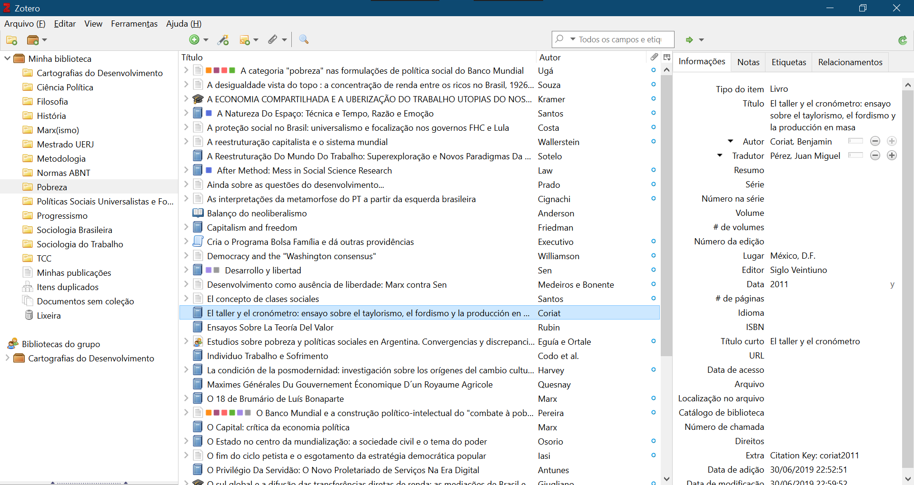
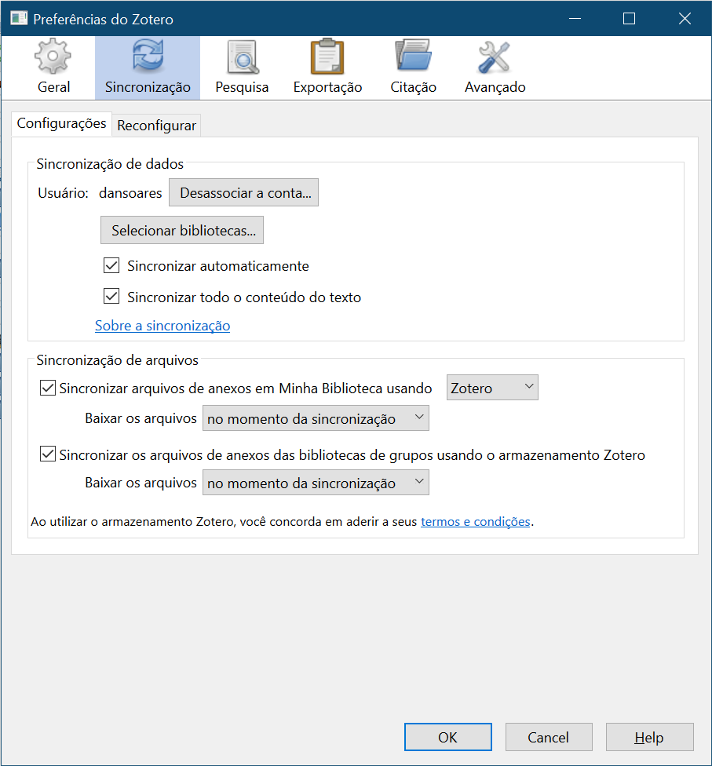
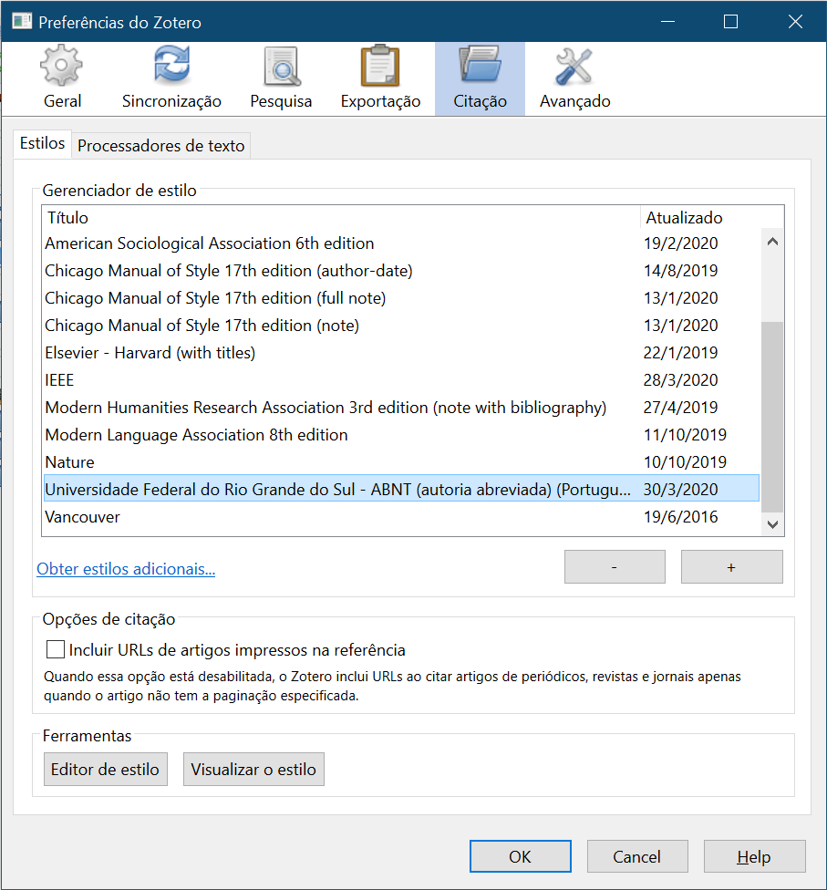
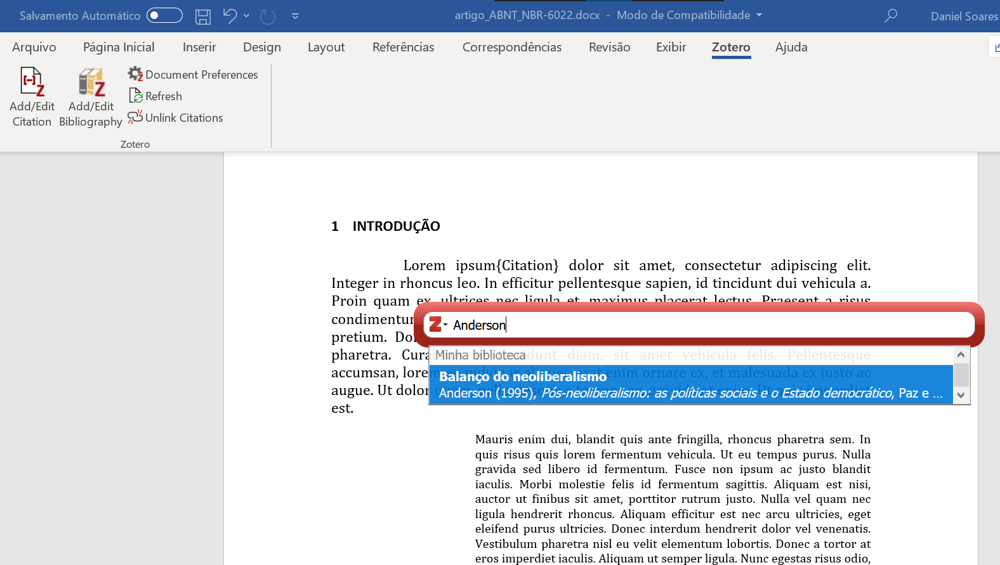

Para começar, vamos falar um pouco sobre gerenciadores de forma geral. Eles são softwares que nos livram do tédio de organizar dezenas (ou centenas) de referências manualmente, as concentrando numa única interface e podendo, com menos de três cliques, adicionar todas as obras citadas ao final de nossos trabalhos já formatados em ABNT (ou APA, Chicago, Harvard, etc.). É fundamental o uso desse tipo de software? De forma alguma, mas dificilmente alguém volta atrás depois que começa a utilizá-los.

Existem vários gerenciadores: [Zotero](https://www.zotero.org/) (Windows, Mac e Linux), [Mendeley](https://www.mendeley.com/) (Windows, Mac, Linux, iOS e Android), [Papers](https://www.papersapp.com/) (Windows, Mac, iOS e Android), o caríssimo [EndNote](https://endnote.com/) (Windows, Mac, iOS e Android), dentro outros.

Cabe aqui um alerta sobre o Mendeley. Esse software pertence a [Elsevier](https://www.elsevier.com/pt-br), empresa do meio científico com práticas ~~bastante malignas~~ altamente questionáveis. A [versão 1.19 do Mendeley](https://www.mendeley.com/release-notes/v1_19), por exemplo, te impede de exportar sua biblioteca para outros softwares, caso queira migrar no futuro, te tornando refém da plataforma. Essa versão criptografa toda a sua biblioteca dentro do seu computador, sem permissão e sem te dar as chaves necessárias para descriptografar, tornando o Mendeley a única forma de você acessar sua biblioteca, ou seja, a única forma de acessar os seus dados. [Eles alegam](https://twitter.com/mendeley_com/status/1006915998841221120) que é para atender a nova legislação europeia de proteção de dados, o que é muito estranho já que, como bem [aponta a equipe do Zotero](https://www.zotero.org/support/kb/mendeley_import), essa legislação foi "projetada para dar às pessoas controle sobre seus dados e garantir a sua portabilidade, não o contrário".

Tendo feito esse ~~desabafo~~ adendo, esse texto vai abordar o uso do Zotero. Primeiro por se tratar de um software de código aberto, feito por pesquisadores, para pesquisadores. Segundo por ser dos poucos que se pode usar sem pagar nada (mais sobre esse assunto adiante). Por fim, pela grande capacidade de expansão por [plugins](https://www.zotero.org/support/plugins).

## Criando a conta e instalando o software

Vamos iniciar [criando uma conta gratuita](https://www.zotero.org/user/register) no Zotero. A criação da conta não é obrigatória, o aplicativo pode funcionar sem ela, mas é altamente recomendado pois com ela você poderá sincronizar sua biblioteca com a "nuvem". Essa sincronização abre a possibilidade de se usar o Zotero em vários computadores e funciona como uma forma de _backup_ da sua biblioteca.

Após a criação da conta, é hora de [baixar e instalar o Zotero](https://www.zotero.org/download/). Se você usa Ubuntu ou outra distro baseada nele, siga [esse tutorial](http://www.ubuntubuzz.com/2018/06/complete-guide-to-install-zotero-on-ubuntu-1804.html). É importante que você já tenha instalado no seu computador o Microsoft Word ou o LibreOffice Writer para que o Zotero se integre a eles já na instalação, fazer essa integração posteriormente é bem mais complexo. Instale também o [Connetor para Chrome](https://chrome.google.com/webstore/detail/ekhagklcjbdpajgpjgmbionohlpdbjgc), é uma extensão que te permitirá adicionar itens diretamente de indexadores como o Google Scholar e SciELO à sua biblioteca.

Usar o software é bastante intuitivo. Na parte lateral esquerda temos nossa biblioteca e biblioteca de grupos (muito útil para grupos de pesquisa), na parte central temos as referências em si e, na lateral direita, os detalhes sobre a referência selecionada. Você pode organizar sua biblioteca da forma que achar melhor criando pastas e subpastas.

Adicionar uma referência também é bastante simples. Você pode adicionar manualmente, clicando no ícone + no menu superior, pode adicionar por ISBN ou DOI da obra (nem sempre funciona, infelizmente) e pode adicionar diretamente do site onde o trabalho está hospedado, seja ele um periódico ou um indexador, com a extensão para Chrome.

Uma observação: o Connector para Chrome só funciona se o Zotero no seu computador estiver aberto.

Por padrão, o software não irá sincronizar seus PDFs com a nuvem deles, sincronizando apenas os dados dos itens que compõe sua biblioteca. Isso porque armazenamento em nuvem custa dinheiro e como o Zotero não tem uma grande empresa por trás e nem usa seus dados para ganhar dinheiro (sim Google, estou falando de vocês), é um custo com o qual eles não podem arcar.

Existem [planos pagos](https://www.zotero.org/settings/storage) que expandem o armazenamento para além dos 300MB da versão gratuita. São US$20/ano por 2GB de armazenamento, US$60/ano por 6GB e US\$120/ano por armazenamento ilimitado (preços consultados em abril de 2020). Apesar de um pouco caros, esses planos valem a pena por dois motivos: (i) é muito mais prático que qualquer outra solução e (ii) você apoiará o trabalho dos desenvolvedores. Uma outra alternativa é usar [WebDAV](https://pt.wikipedia.org/wiki/WebDAV) como armazenamento, esse [artigo de suporte](https://www.zotero.org/support/sync#webdav) fala mais sobre essa funcionalidade e [aqui tem uma lista de serviços WebDAV gratuitos](https://www.zotero.org/support/kb/webdav_services). Você pode também escolher não usar nem o plano pago e nem WebDAV, mas é por sua conta e risco.

Se você é um usuário mais avançado deve ter notado que o Zotero cria uma pasta dentro da sua pasta de usuário com a sua biblioteca (banco de dados e anexos) e pode ter pensado: “hm, eu poderia por essa pasta dentro do Dropbox ou do Google Drive e economizar uns trocados”. Infelizmente, isso é altamente desaconselhável. A forma como esses serviços em nuvem sincronizam os arquivos pode corromper sua base de dados de forma irreparável. Mas você pode, no entanto, fazer backup manualmente copiando essa pasta inteira para um HD externo ou mesmo para serviços de nuvem como os já citado, mas faça isso com o Zotero fechado para garantir que ele não estará escrevendo na base de dados no momento da cópia.

Outro passo que precisando dar é ajustar o nosso Zotero para gerar referências em ABNT. Para isso basta ir na aba Citação, clicar no botão + e [adicionar esse arquivo](abnt.csl) feito pelo pessoal da UFRGS.

## Utilizando o Zotero em conjunto com o Microsoft Word

Depois de instalar o Zotero em seu computador, ele instalará um complemento que te permitirá adicionar itens da sua biblioteca diretamente ao texto que você esteja escrevendo.

O processo todo não poderia ser mais simples. Ao abrir o Word, você notará uma nova aba chamada Zotero. Nessa aba temos cinco botões autoexplicativos.

O primeiro, _Add/edit Citation_, vai fazer aparecer uma caixa flutuante onde nos permite escolher o autor a ser citado.

O segundo, _Add/edit Bibliography_, é para ser usado ao final do seu texto para gerar a lista de referências bibliográficas já devidamente formatas e em ordem alfabética.

Por fim, o último botão que usaremos com alguma frequência é o _Refresh_. Ele serve para atualizar a bibliografia gerada ao final do seu texto depois de uma modificação.

E é isso. Simples assim.

## Considerações finais

Nem tudo são flores, entretanto. O Zotero tem uma grande falha em relação aos concorrentes: a falta de apps para iOS e Android, apesar de desconfiar que estejam [trabalhando nisso](https://twitter.com/zotero/status/1069690493053726720). Existe, para iOS, um app chamado [PeperShip](https://www.papershipapp.com) que funciona como um cliente para Zotero e Mendeley, mas [foi comprado em 2016 pela Elsevier](http://blog.shazino.com/articles/hivebench/hivebench-acquisition/) e foi praticamente abandonado desde então (mais um motivo para desconsiderar totalmente o uso do Mendeley).

Apesar disso, o Zotero segue sendo uma das melhores e mais convenientes soluções para gerenciamento de referências bibliográficas, além de ser mantido por pessoas muito dedicadas e transparentes.
