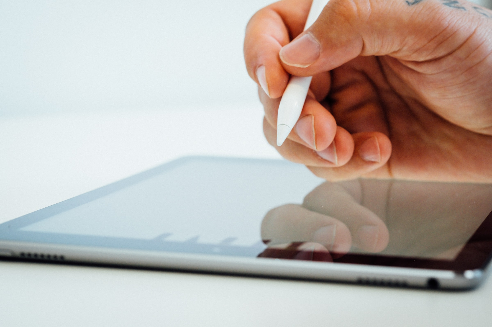
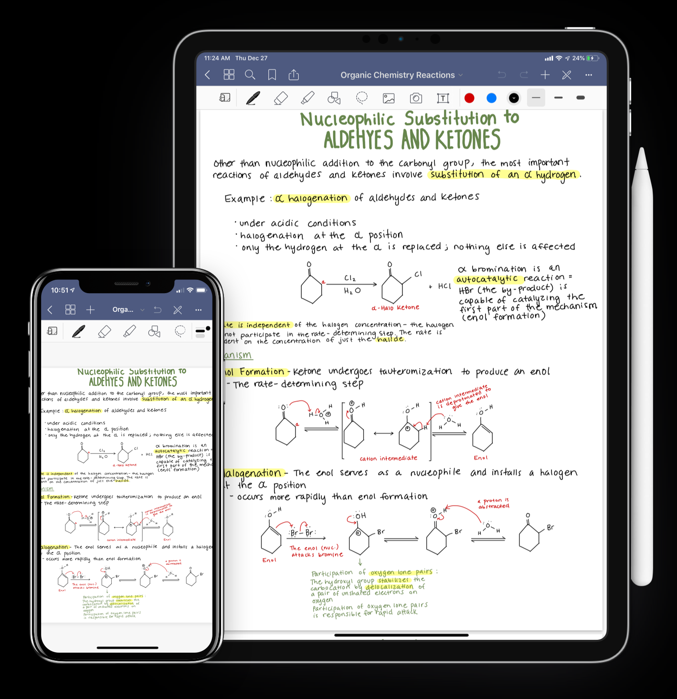

Esse será um texto bastante diferente dos dois anteriores. Quero falar um pouco da minha experiência com o iPad para estudar. É um tema bastante comum entre estudantes universitários: o iPad substitui o meu computador/notebook? A resposta curta é **não**.

De um ponto de vista mais amplo, o iPad, mesmo em sua versão mais cara e completa, não substitui completamente um computador tradicional quando se trata de agilidade. Utilizar teclado, mouse e uma organização e aplicativos em janelas que podem ser sobrepostas e em telas que são, em geral, muito maiores, é infinitamente mais produtivo que utilizar um iPad.

Isso não quer dizer, entretanto, que o iPad é inútil e que serve apenas para Netflix. Pelo contrário, ele pode ser um excelente aliado quando se tem recursos financeiros que te permitam ter tanto um computador tradicional quanto um iPad.

O erro, ao meu ver, consiste em entender o iPad como um potencial substituto do computador (e nisso tem uma boa dose de culpa da Apple) quando ele deveria ser entendido como um complemento e, como todo complemento, entender que seu uso não é essencial.

Eu comprei meu atual iPad na tentativa de fazê-lo ser esse substituto que a Apple nos faz pensar que ele pode ser. Bom, ele não é. Mesmo para tarefas que, tecnologicamente falando, são bastante simples como pesquisa, leitura e escrita.

É possível fazer essas três coisas e conheço algumas pessoas que o fazem, mas não é confortável como num notebook.

Uma analogia que resumiria bem o iPad como substituto de um computador seria compará-lo com um pato (pode andar, voar e nadar, mas não faz nenhuma das três coisas bem).

No meu uso, o iPad se destaca apenas num ponto: leitura. Nisso ele é imbatível. Apesar de ainda preferir ler no papel, se tornou inviável imprimir tudo que preciso ler, mesmo imprimindo frente e verso e com quatro páginas por face, como vim fazendo nos últimos por anos por motivos de “não há mais espaço físico na minha casa”, isso sem entrar no mérito de que é ecologicamente imoral.

Voltando ao assunto original (desculpe a tendência de fugir do assunto), a leitura no iPad é muito mais confortável do que no computador. Ainda mais com uma caneta para marcar e anotar nas margens.

Outro ponto que o iPad se tornou bastante útil foi como substituto do caderno. Fazer anotações no iPad é inclusive muito mais seguro. Eu perdi um caderno com dois semestres de pesquisa e olha, foi duro ao ponto de me fazer desistir da pesquisa inteira porque eu não tinha condições de recomeçar.

Para esses dois casos, eu utilizo um aplicativo chamado [GoodNotes](https://www.goodnotes.com/) que é incrivelmente bom (apesar de incrivelmente caro).

Ainda utilizo um caderno de verdade em certas ocasiões como reuniões rápidas onde o uso do iPad roubaria a atenção ou sentado no fundo de um auditório lotado ouvindo uma palestra. Para esses casos um caderno tamanho A5 de capa dura ainda é um bom companheiro (e muito mais charmoso).

Em suma, a recomendação que eu posso fazer é: se você tem condições financeiras para ter um computador e um iPad, ótimo, se não tem, um computador normal lhe será muito mais útil na sua jornada como estudante.
